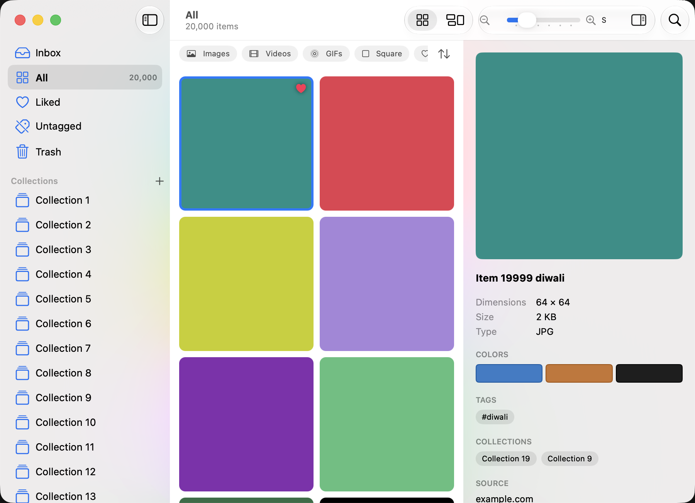

# Stash

An open-source, team-shareable inspiration library for macOS. Save images, videos, links and pages; find them again with
tags, collections, smart folders, search and a command palette; and share one library with your whole team through a
synced folder (Google Drive, Dropbox, iCloud). No server, no accounts.



## What it does
- **Fast grid** (square or masonry) that stays smooth at 20,000+ items; zoom with pinch or ⌘-scroll, space to preview.
- **Organize**: collections and folders, tags with colours, likes, notes, smart folders (rule-based), filters and sort.
- **Find**: ⌘K command palette, ⌘F full-text search (names, tags, notes, sources), "added by" filter.
- **Capture**: paste (⌘V), drop on the menu bar item, a Chrome extension (right-click or ⌥-click any image), link cards
  with preview image or page snapshot, Figma links.
- **Team**: one shared library folder; changes from teammates appear within seconds; conflict-safe; works with Drive's
  Mirror or Stream modes. See [docs/TEAM_SETUP.md](docs/TEAM_SETUP.md).
- **Undo everything** (⌘Z / ⇧⌘Z), rebindable shortcuts, light and dark mode.

Files stay plain files: a library is a folder of items and small JSON sidecars you can open in Finder.

## Install
Download `Stash-0.1.0.dmg`, drag Stash to Applications, then right-click ▸ Open the first time (not notarized yet).
Requires macOS 14 or later.

## Build
```bash
brew install xcodegen
xcodegen
xcodebuild -scheme Stash -destination 'platform=macOS' build
cd Packages/StashKit && swift test            # library, index, sync, API tests
cd ../../Extensions/chrome-tests && node --test *.test.mjs
Scripts/make-dmg.sh                           # dist/Stash-<version>.dmg
```
UI tests and how to run them are described in [PROGRESS.md](PROGRESS.md).

## Layout
`Packages/StashKit` (all logic, no UI) · `Apps/Stash` (SwiftUI/AppKit app) · `Apps/StashCLI` (CLI, coming) ·
`Extensions/chrome` (browser extension) · [PLAN.md](PLAN.md) (roadmap).

MIT licensed.
